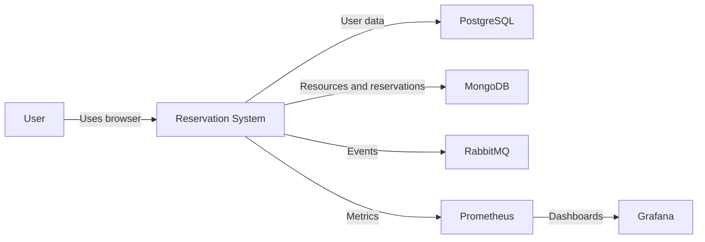
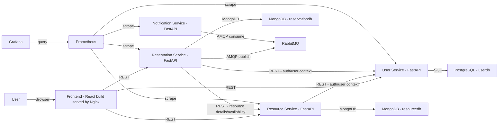
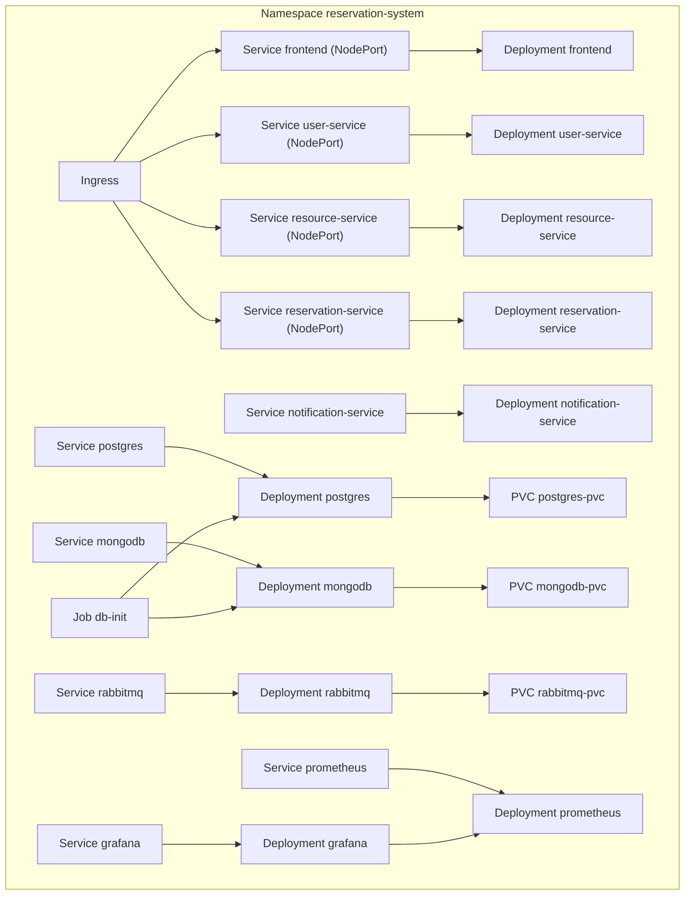
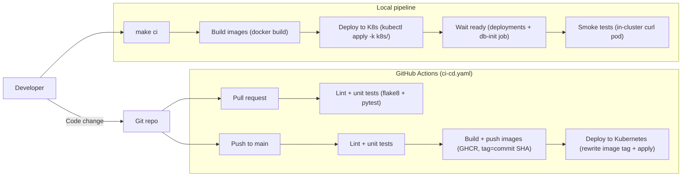

# Library & Office Slot Reservation System

A microservices-based reservation system for booking library desks, study rooms, meeting rooms, and office spaces. Built with Python FastAPI, deployed on Kubernetes with complete CI/CD pipeline and monitoring.

## Architecture

```
┌─────────────────────────────────────────────────────────────────┐
│                         Ingress Controller                       │
└─────────────────────────────────────────────────────────────────┘
                              │
        ┌─────────────────────┼─────────────────────┐
        ▼                     ▼                     ▼
┌───────────────┐    ┌────────────────┐    ┌────────────────┐
│  User Service │    │ Resource       │    │ Reservation    │
│  (Port 30000) │    │ Service (31001)│    │ Service (31002)│
└───────────────┘    └────────────────┘    └────────────────┘
        │                     │                     │
        │                     │                     ▼
        │                     │            ┌────────────────┐
        │                     │            │ Notification   │
        │                     │            │ Service (31003)│
        │                     │            └────────────────┘
        │                     │                     │
        ▼                     ▼                     ▼
┌───────────────┐    ┌────────────────┐    ┌────────────────┐
│  PostgreSQL   │    │   MongoDB      │    │   RabbitMQ     │
│ (Port 30432)  │    │  (Port 30017)  │    │   AMQP:30672   │
│               │    │                │    │   Mgmt:31672.  │
└───────────────┘    └────────────────┘    └────────────────┘
```

### Architecture Diagrams (Mermaid)

#### 1) System Context (Beginner-friendly)



This diagram shows the system at the highest level: a user accesses a single product, which depends on databases (PostgreSQL + MongoDB), a message queue (RabbitMQ), and monitoring (Prometheus/Grafana).

#### 2) Microservices / Container View (How requests flow)



This diagram breaks the system into the frontend plus four backend services. Each service owns its data store (PostgreSQL for users, MongoDB for resources/reservations). Reservation events are published to RabbitMQ and consumed by the notification service.

#### 3) Kubernetes Structure (How it runs on the cluster)



This diagram maps the same application onto Kubernetes primitives: Ingress routes traffic to Services, Services target Deployments, stateful components use PVCs, and a one-time db-init Job seeds the databases.

#### 4) CI/CD Pipeline (Local + GitHub Actions)



This diagram shows two pipelines: a local one (`make ci`) for fast feedback, and an automated GitHub Actions pipeline that validates changes (lint/tests), builds/pushes images, and deploys to Kubernetes when changes reach main.

## Microservices

| Service | Port | Description | Database |
|---------|------|-------------|----------|
| **User Service** | 30000 | Authentication, user management, JWT tokens | PostgreSQL |
| **Resource Service** | 31001 | Manage rooms, desks, and bookable resources | MongoDB |
| **Reservation Service** | 31002 | Handle reservations, availability checking | MongoDB |
| **Notification Service** | 31003| Send email notifications via message queue | RabbitMQ |

## Tech Stack

- **Backend**: Python 3.11, FastAPI
- **Databases**: PostgreSQL, MongoDB
- **Message Queue**: RabbitMQ
- **Containerization**: Docker
- **Orchestration**: Kubernetes
- **CI/CD**: GitHub Actions
- **Monitoring**: Prometheus, Grafana
- **Authentication**: JWT (JSON Web Tokens) with Hybrid Security Model

## Security Model

This system implements a **hybrid security approach** that balances user experience with data protection:

### Public Endpoints (No Authentication)
- **GET /api/v1/resources** - Browse available resources (rooms, desks)
- **GET /api/v1/resources/available** - View currently available resources
- **GET /api/v1/resources/search** - Search for resources
- **GET /api/v1/resources/{id}** - View resource details

**Rationale**: Similar to e-commerce websites where product browsing is public but checkout requires login, allowing users to explore available rooms and desks before creating an account encourages engagement and improves user experience.

### Protected Endpoints (Requires Authentication)
- **POST /api/v1/resources** - Create new resources (admin only)
- **PUT /api/v1/resources/{id}** - Update resources (admin only)
- **DELETE /api/v1/resources/{id}** - Delete resources (admin only)
- **POST /api/v1/reservations** - Make reservations (authenticated users)
- **GET /api/v1/reservations/user** - View user's reservations
- **PUT /api/v1/reservations/{id}** - Cancel/modify reservations

**Benefits of This Approach**:
-  Reduces friction for new users exploring the system
-  Protects sensitive operations (creating reservations, modifying data)
-  Follows industry best practices (similar to Airbnb, booking.com)
-  All write operations require authentication
-  Personal data (user reservations) is fully protected
-  **Consistent JWT secret across Docker Compose and Kubernetes** so tokens issued in one environment remain valid in the other. If you rotate the secret, update both `docker-compose.yml` and the `app-secrets` Kubernetes secret together.

## Project Structure

```
reservation-system/
├── services/
│   ├── user-service/           # User authentication & management
│   ├── resource-service/       # Resource (rooms/desks) management
│   ├── reservation-service/    # Reservation handling
│   └── notification-service/   # Email notifications
├── k8s/
│   ├── namespace.yaml
│   ├── ingress.yaml
│   ├── configmaps/
│   ├── secrets/
│   ├── databases/
│   └── deployments/
├── monitoring/
│   ├── prometheus/
│   └── grafana/
├── .github/
│   └── workflows/
│       └── ci-cd.yaml
├── docker-compose.yml
└── README.md
```

## Quick Start

### Local CI/CD (one command)

From the repo root:

```bash
cd /Users/sudeatesoglu/Desktop/Akademik/CMPE363/reservation-system

# Build images -> apply k8s -> wait for db-init -> smoke test -> port-forward frontend
make up

# Same as above, but do NOT port-forward (CI mode)
make ci

# Port-forward ALL services (frontend, APIs, databases, monitoring)
make pf

# Full pipeline + all port-forwards
make up-all
```

Scripts used:
- `scripts/pipeline/build-images.sh`
- `scripts/pipeline/deploy-k8s.sh`
- `scripts/pipeline/smoke-test.sh`
- `scripts/pipeline/run-local-cicd.sh`
- `scripts/pipeline/port-forward-all.sh`

Optional flags:
- `NAMESPACE=reservation-system` (default)
- `TIMEOUT=300s` (default)
- `OPEN_FRONTEND=0` (skip frontend port-forward)

### Prerequisites

- Docker & Docker Compose
- Kubernetes cluster (Minikube, Kind, or cloud)
- kubectl configured
- Python 3.11+

### Database Initialization

Before starting the services, initialize the databases with sample data:

```bash
# Option 1: Initialize all databases at once
./scripts/init_databases.sh

# Option 2: Initialize individually
./scripts/init_postgres.sh    # PostgreSQL (users)
python3 scripts/init_mongodb.py  # MongoDB (resources & reservations)

# Option 3: Initialize via Docker Compose (one-time setup)
docker-compose --profile init up db-init
```

**What gets initialized:**
- **PostgreSQL**: `users` table with demo user (demo@example.com / Demo123!)
- **MongoDB (resourcedb)**: 8 sample resources (meeting rooms, study rooms, etc.)
- **MongoDB (reservationdb)**: Empty reservations collection, ready for bookings

### Local Development with Docker Compose

```bash
# Clone the repository
git clone https://github.com/yourusername/reservation-system.git
cd reservation-system

# Start all services
docker-compose up -d

# Check service health
curl http://localhost:30000/health  # User Service
curl http://localhost:30001/health  # Resource Service
curl http://localhost:30002/health  # Reservation Service
curl http://localhost:30003/health  # Notification Service

# View logs
docker-compose logs -f

# Stop services
docker-compose down
```

### Access Points (Local)

| Service | URL |
|---------|-----|
| User Service API | http://localhost:30000/docs |
| Resource Service API | http://localhost:31001/docs |
| Reservation Service API | http://localhost:31002/docs |
| Notification Service | http://localhost:31003/health |
| RabbitMQ Management | http://localhost:30672 (guest/guest) |
| Prometheus | http://localhost:30909 |
| Grafana | http://localhost:30300 (admin/admin) |

## 📖 API Documentation

Each service exposes Swagger documentation at `/docs` endpoint.

### User Service Endpoints

```
POST   /api/v1/auth/register     - Register new user
POST   /api/v1/auth/login        - Login and get JWT token
GET    /api/v1/users/me          - Get current user profile
PUT    /api/v1/users/me          - Update profile
POST   /api/v1/users/me/change-password - Change password
GET    /api/v1/users             - List all users (admin)
```

### Resource Service Endpoints

```
GET    /api/v1/resources         - List resources
GET    /api/v1/resources/available - Get available resources
GET    /api/v1/resources/search  - Search resources
GET    /api/v1/resources/{id}    - Get resource details
POST   /api/v1/resources         - Create resource (admin)
PUT    /api/v1/resources/{id}    - Update resource (admin)
DELETE /api/v1/resources/{id}    - Delete resource (admin)
GET    /api/v1/resource-types    - Get resource types
```

### Reservation Service Endpoints

```
POST   /api/v1/reservations           - Create reservation
GET    /api/v1/reservations/my        - Get my reservations
GET    /api/v1/reservations/{id}      - Get reservation details
PUT    /api/v1/reservations/{id}      - Update reservation
POST   /api/v1/reservations/{id}/cancel - Cancel reservation
GET    /api/v1/availability/{resource_id} - Get availability
```

## Kubernetes Deployment

### Deploy to Kubernetes

```bash
# Create namespace
kubectl apply -f k8s/namespace.yaml

# Apply configs and secrets
kubectl apply -f k8s/configmaps/
kubectl apply -f k8s/secrets/

# Deploy databases
kubectl apply -f k8s/databases/

# Wait for databases to be ready
kubectl wait --for=condition=ready pod -l app=postgres -n reservation-system --timeout=120s
kubectl wait --for=condition=ready pod -l app=mongodb -n reservation-system --timeout=120s
kubectl wait --for=condition=ready pod -l app=rabbitmq -n reservation-system --timeout=120s

# Deploy microservices
kubectl apply -f k8s/deployments/

# Apply ingress
kubectl apply -f k8s/ingress.yaml

# Check status
kubectl get pods -n reservation-system
kubectl get services -n reservation-system
```

### Build and Push Images

```bash
# Build images
docker build -t reservation-system/user-service:latest ./services/user-service
docker build -t reservation-system/resource-service:latest ./services/resource-service
docker build -t reservation-system/reservation-service:latest ./services/reservation-service
docker build -t reservation-system/notification-service:latest ./services/notification-service

# Tag and push to registry
docker tag reservation-system/user-service:latest your-registry/user-service:latest
docker push your-registry/user-service:latest
# ... repeat for other services
```

## CI/CD Pipeline

The GitHub Actions pipeline automatically:

1. **Test**: Runs linting and unit tests for all services
2. **Build**: Builds Docker images and pushes to GitHub Container Registry
3. **Deploy**: Deploys to Kubernetes cluster on push to main branch

### Required Secrets

Configure these in GitHub repository settings:

- `KUBE_CONFIG`: Base64 encoded kubeconfig file

## Monitoring

### Prometheus Metrics

Each service exposes metrics at `/metrics`:

- `http_requests_total` - Total HTTP requests
- `http_request_duration_seconds` - Request latency histogram

### Grafana Dashboards

Pre-configured dashboard shows:

- Request rate per service
- Response time (p95)
- Total requests per service

## Testing

```bash
# Run tests for a service
cd services/user-service
pip install -r requirements.txt
pip install pytest pytest-asyncio httpx
pytest tests/ -v

# Run with coverage
pytest tests/ --cov=app --cov-report=html
```

## Team Contributions

| Member | Responsibilities |
|--------|-----------------|
| Member 1 | User Service, Authentication, CI/CD Pipeline |
| Member 2 | Resource Service, Reservation Service, Kubernetes Deployment |

## License

This project is for educational purposes - CMPE363 Semester Project.

## 🔗 Links

- [FastAPI Documentation](https://fastapi.tiangolo.com/)
- [Kubernetes Documentation](https://kubernetes.io/docs/)
- [Docker Documentation](https://docs.docker.com/)
- [Prometheus](https://prometheus.io/)
- [Grafana](https://grafana.com/)
